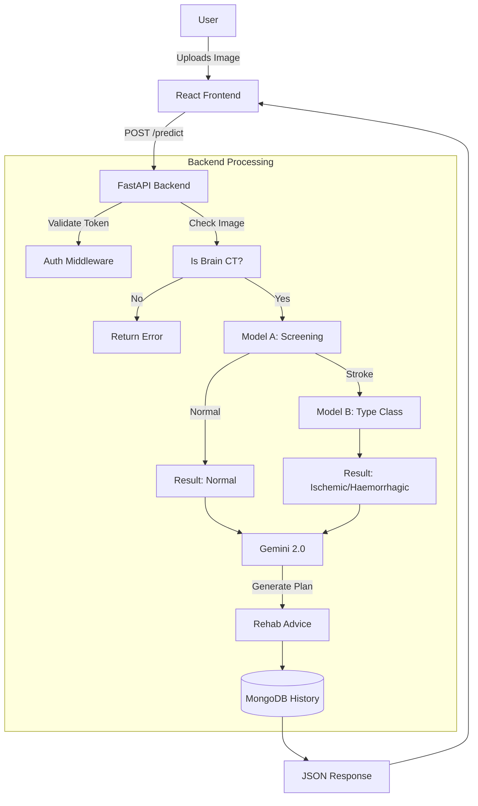
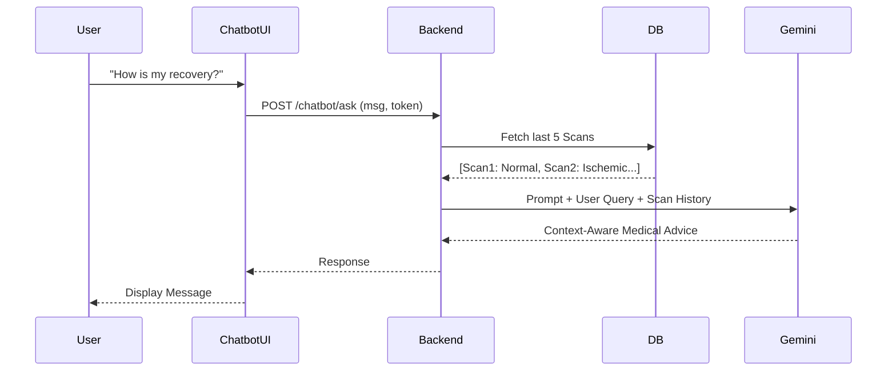

# NeuroScan AI - Brain Stroke Detection & Rehabilitation Platform

## 1. Project Overview
NeuroScan AI is a comprehensive medical support system designed to assist in the early detection and rehabilitation of brain strokes. It combines Deep Learning (CNNs), Generative AI (Google Gemini), and a modern Web Application to provide end-to-end support for patients and doctors.

**Key capabilities:**
- **Automated Diagnosis:** Detects if a CT Scan is Normal or Stroke-affected.
- **Stroke Typing:** If a stroke is found, it classifies it as Ischemic (Clot) or Haemorrhagic (Bleed).
- **Personalized Rehabilitation:** Uses Generative AI to create custom recovery plans.
- **Medical History:** Tracks patient progress and past scan results.
- **Context-Aware Chatbot:** A smart assistant that knows the patient's history and offers 24/7 support.

---

## 2. Dataset & Preprocessing

### 2.1 The Dataset
The model was built using the **Brain Stroke CT Image Dataset**, structured into three classes:
- **Normal:** Healthy brain scans.
- **Ischemic:** Scans showing blockage/clots.
- **Haemorrhagic:** Scans showing bleeding.

### 2.2 Data Pipeline
We implemented a robust pipeline to prepare data for our two-stage model architecture:

**Step 1: Data Gathering (`scripts/prepare_datasets.py`)** 
- Scans directory recursively for `.jpg` and `.png` files.
- **Dataset A Creation:** Merges 'Ischemic' and 'Haemorrhagic' into a single 'Stroke' class (Label 1) vs 'Normal' (Label 0).
- **Dataset B Creation:** Filters only 'Stroke' images. Maps 'Ischemic' (0) vs 'Haemorrhagic' (1).
- **Splitting:** Data is shuffled and split into Train (80%), Val (10%), Test (10%).
- **Output:** Generates `dataset_a.csv` and `dataset_b.csv` for reproducible training.

**Step 2: Preprocessing**
- **Resizing:** All images are resized to **224x224** pixels.
- **Normalization:** Pixel values normalized to range `[0, 1]`.
- **Augmentation:** To prevent overfitting, training applies:
  - Rotation (20°)
  - Width/Height Shift (20%)
  - Horizontal Flip

---

## 3. Machine Learning Architecture

We purposefully chose a **Hierarchical (Two-Stage) Approach** to maximize accuracy.

### 3.1 Model A (Screening Model)
- **Goal:** Filter out normal patients first to reduce false alarms.
- **Architecture:** **ResNet50** (Transfer Learning)
  - **Base:** Pre-trained on ImageNet (weights frozen).
  - **Head:** GlobalAveragePooling -> Dense(256, ReLU) -> Dropout(0.5) -> Dense(1, Sigmoid).
- **Performance:** High sensitivity for detecting anomalies.

### 3.2 Model B (Classification Model)
- **Goal:** Determine the specific type of stroke for critical treatment decisions (e.g., blood thinners kill haemorrhagic patients).
- **Architecture:** **ResNet50** (Same backbone for consistency).
- **Logic:** Only runs if Model A predicts "Stroke" with >50% confidence.

### 3.3 The Engine (`ml_engine.py`)
- **Heuristic Validation:** Includes an `is_brain_ct()` check to reject invalid uploads (e.g., cat photos).
- **Inference Flow:** 
  1. Image -> Preprocess -> Model A.
  2. If Normal -> Return "Healthy".
  3. If Stroke -> Pass original image -> Model B -> Return Type (Ischemic/Haemorrhagic).

---

## 4. System Architecture & Flows

### 4.1 Technology Stack
| Layer | Technologies |
|-------|--------------|
| **Frontend** | React, Vite, TailwindCSS, Framer Motion, Lucide Icons |
| **Backend** | Python, FastAPI, Uvicorn |
| **Database** | MongoDB (Data), Beanie (ODM) |
| **AI/ML** | TensorFlow/Keras (Vision), Google Gemini 2.0 (GenAI) |
| **Auth** | JWT (JSON Web Tokens), Passlib (Bcrypt) |

### 4.2 Application Flow



### 4.3 Chatbot Flow (Context-Aware)



---

## 5. Implementation Guide

### 5.1 Backend Setup
1. **Initialize Project:**
   ```bash
   python -m venv venv
   source venv/bin/activate
   pip install -r requirements.txt
   ```
2. **Environment Variables (`.env`):**
   - `JWT_SECRET`: For secure auth.
   - `GEMINI_API_KEY`: For chatbot features.
   - `MONGO_URL`: Database connection.
3. **Training:**
   - Run `python scripts/prepare_datasets.py` to organize data.
   - Run `python scripts/train_model_a.py` and `train_model_b.py`.

### 5.2 Frontend Setup
1. **Install Dependencies:**
   ```bash
   cd apps/web
   npm install
   ```
2. **Run Dev Server:**
   ```bash
   npm run dev
   ```

### 5.3 Key Features Implementation
- **JWT Auth:** Implemented in `routers/auth.py` using `OAuth2PasswordBearer`.
- **History:** Stored in MongoDB `scan_records` collection, linked by `user_id`.
- **GenAI:** Uses `google.generativeai` SDK with `gemini-flash-latest` model for speed and accuracy.

---

## 6. Future Roadmap
- [ ] **DICOM Support:** Native handling of medical `.dcm` files.
- [ ] **Doctor Portal:** Separate login for doctors to review patient scans.
- [ ] **Real-time Notifications:** Email alerts for high-risk detections.
